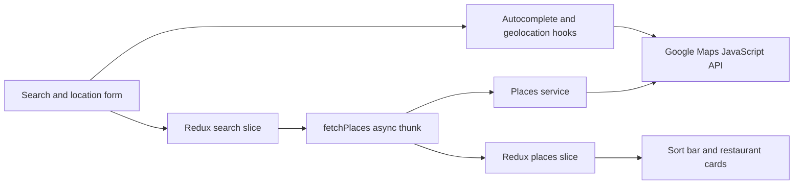

<div align="center">
  
  <h1>Ravenous</h1>
  <p><strong>Find a table worth talking about.</strong></p>
  <p>A responsive restaurant discovery app built with React, Redux Toolkit, and Google Maps Platform.</p>
  <p>
    <a href="https://github.com/M-spina/Ravenous/actions/workflows/quality.yml"></a>
  </p>
</div>

Ravenous turns a cuisine or restaurant query and a location into a sortable set of nearby places. It was built as a portfolio project focused on predictable state management, resilient browser API interactions, accessible UI, and production-minded quality checks.

There is no hosted deployment yet. The interface includes Google attribution, optional precise-location withdrawal, and draft standalone legal pages.

## Features

- Search restaurants by term and location with Google Places Text Search.
- Choose an autocomplete suggestion or enter and edit a location manually.
- Use browser geolocation, then reverse-geocode the position into a readable location.
- Sort results by best match, rating, or review count.
- Compare ratings, review totals, price levels, categories, and addresses.
- Flip a restaurant card to reveal phone, opening hours, and a Google Maps link.
- See clear loading, empty, Google Maps, search, geolocation, and reverse-geocoding feedback.
- Use the responsive interface with keyboard controls and accessible labels.

## How it works



The search slice owns the query and location text. The places slice owns coordinates, Google Maps readiness, request status, results, errors, and the active sort. Async thunks keep network state transitions in Redux, while autocomplete and geolocation retain their interaction-specific lifecycle state in hooks.

The Google integration is split into small utilities:

- `loadGoogleMaps.js` loads and reuses the Places library.
- `placesService.js` performs text search and optional coordinate biasing.
- `geocodingService.js` reverse-geocodes browser coordinates.
- `API_Utilities.js` transforms Google Place objects into the UI model.

## Tech stack

| Area | Technology |
| --- | --- |
| UI | React 19, Tailwind CSS 4, shadcn/ui primitives, Lucide icons |
| State | Redux Toolkit, React Redux |
| Data | Google Maps JavaScript API, Places API (New), Geocoding API |
| Tooling | Vite 7, ESLint 9 |
| Tests | Vitest, Testing Library, jsdom |
| CI | GitHub Actions on Node.js 24 |

## Getting started

### Prerequisites

- [Node.js 24 LTS](https://nodejs.org/en/download)
- npm (included with Node.js)
- A Google Cloud project with billing enabled
- The Maps JavaScript API, Places API (New), and Geocoding API enabled

### Install

```bash
git clone https://github.com/M-spina/Ravenous.git
cd Ravenous
npm ci
cp .env.example .env
```

Open `.env` and replace the placeholder with your restricted browser key:

```dotenv
VITE_GOOGLE_MAPS_API_KEY=replace_with_your_restricted_browser_key
```

Start the development server:

```bash
npm run dev
```

Vite prints the local URL, normally `http://localhost:5173`.

## Google Maps key safety

`VITE_GOOGLE_MAPS_API_KEY` is public browser configuration. Vite substitutes it into the client bundle, so anyone who can load the app can inspect it. Keeping `.env` out of Git prevents accidental source-control exposure, but it does **not** make the key secret at runtime.

Before using a key:

1. In Google Cloud Console, set its application restriction to **Websites (HTTP referrers)**.
2. Allow only the origins that need the app, such as local development and the exact future production origin. Do not use unrestricted wildcards in production.
3. Add API restrictions for **Maps JavaScript API**, **Places API (New)**, and **Geocoding API** only.
4. Use separate keys for separate applications or environments, and configure quotas and billing alerts.
5. Never commit `.env` or paste a real key into issues, logs, screenshots, or documentation.

Google's current guidance recommends both application and API restrictions for browser keys. See [Google Maps Platform security guidance](https://developers.google.com/maps/api-security-best-practices), [Text Search (New) setup](https://developers.google.com/maps/documentation/javascript/place-search), and the [Maps JavaScript geocoding setup](https://developers.google.com/maps/documentation/javascript/geocoding).

### If a key is exposed

1. Revoke or rotate the exposed key in Google Cloud Console immediately.
2. Create a replacement with the restrictions above.
3. Update only your local `.env` and any authorized deployment configuration.
4. Review Google Cloud usage and billing for unexpected traffic.

Removing a key from the latest commit—or rewriting Git history—does not revoke copies that have already been seen. Rotation is the security boundary.

## Available commands

| Command | Purpose |
| --- | --- |
| `npm run dev` | Start the Vite development server |
| `npm run lint` | Run ESLint across the project |
| `npm test` | Run the Vitest suite once |
| `npm run test:watch` | Run Vitest in watch mode |
| `npm run build` | Create a production build in `dist/` |
| `npm run preview` | Serve the production build locally |

## Testing and quality

The test suite covers the Redux-backed search flow, request lifecycle behavior, geolocation feedback and cache options, empty states, sorting, price-level mapping, and accessible restaurant-card interactions.

Every pull request and push to `main` runs the GitHub Actions `Quality` job:

```text
npm ci → npm run lint → npm test → npm run build
```

Run the same checks locally before opening a pull request:

```bash
npm run lint
npm test
npm run build
```

## Project structure

```text
src/
├── components/      Search, sorting, restaurant cards, and UI primitives
├── hooks/           Autocomplete and browser-geolocation behavior
├── store/           Redux store, slices, selectors, and async thunks
├── test/            Shared test setup and store-backed render helper
├── utilities/       Google Maps loading, Places search, geocoding, transforms
├── App.jsx          Page composition and result/error states
└── main.jsx         React and Redux application entry point
```

## Current limitations

- There is no live deployment or dedicated restaurant-details route.
- Search and geolocation require a valid Google Cloud billing setup, enabled APIs, quota, and a correctly restricted browser key.
- Restaurant availability and field completeness depend on Google Places data; missing phone, hours, or links are shown as unavailable.
- Before a public deployment, review Google Maps Platform policy requirements for attribution, privacy, and terms pages against the final hosting setup.

## Lessons learned

- A controlled input should have one source of truth; duplicating Redux-backed form state locally creates synchronization bugs.
- Debounced autocomplete needs timer cleanup and stale-request invalidation, not just delayed fetching.
- Browser geolocation is a multi-step interaction: permission, position lookup, reverse geocoding, and manual recovery each need explicit feedback.
- Accessibility and release hygiene are easiest to preserve when lint, tests, and production builds are required on every pull request.
- A browser API key is protected through least-privilege platform restrictions and rotation—not by treating bundled configuration as a secret.

## Launch preparation

These changes are delivered as four stacked draft PRs. Review dependency updates, Google attribution/legal structure, privacy controls, then security configuration.

- [Dependency audit](docs/dependency-security.md)
- [Google attribution](docs/google-attribution.md)
- [Privacy and owner actions](docs/privacy-readiness.md)
- [Bundled image provenance](docs/asset-provenance.md)
- [Host headers and launch verification](docs/security-deployment.md)

The legal pages deliberately contain marked owner/host placeholders. Complete them and the HTTPS, storage/access and account checks before public deployment. Vite preview applies candidate headers; a production host needs its own HTTP-header configuration.
